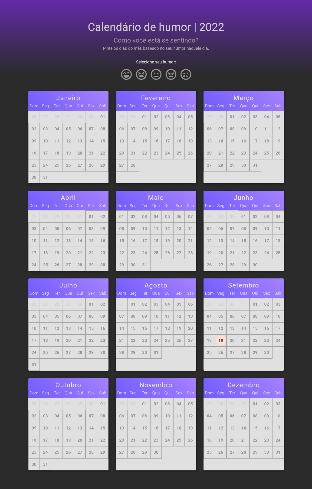

# Mood calendar

## 📷 Screenshots

  

## 💻 Projeto
Aplicação que colore os dias do mês baseado no seu humor naquele dia.

## 🧪 Tecnologias utilizadas
- [React](https://reactjs.org)
- [TypeScript](https://www.typescriptlang.org/)
- [SASS](https://sass-lang.com/)
